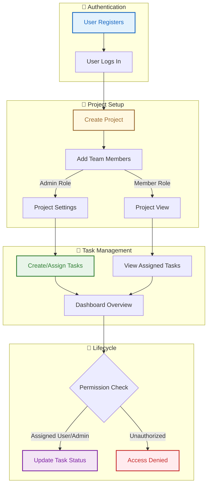

# FlowDesk

FlowDesk is a clean, modern, and high-performance task management application built with Flask and Vanilla CSS. It features a stunning "Editorial Parchment" design language with full dark mode support, role-based access control, and a dynamic dashboard.

## 🚀 Live URL
[https://flowdesk-production.up.railway.app](https://flowdesk-production.up.railway.app)

## ✨ Features
- **Authentication**: Secure signup/login/logout with Flask-Login and Werkzeug hashing.
- **Project Management**: Create projects, manage team members (Admins/Members), and track project-specific progress.
- **Task Management**: Create, assign, and edit tasks. Real-time status updates via async JSON requests.
- **Role-Based Access Control (RBAC)**: Detailed permission system for project settings and task management.
- **Dynamic Dashboard**: Personalized summary of tasks due today, in-progress work, and overdue alerts.
- **Editorial Parchment Design**: A premium, state-of-the-art UI with responsive layouts and fluid typography.
- **Dark Mode**: Native dark mode support with localStorage persistence.

## 🛠️ Tech Stack
- **Backend**: Flask, SQLAlchemy (ORM)
- **Database**: SQLite (Local), PostgreSQL (Production)
- **Frontend**: Vanilla CSS (Custom Design System), Vanilla JS, Jinja2
- **Package Manager**: [uv](https://github.com/astral-sh/uv)
- **Deployment**: Railway

## 🎨 Application Workflow



## 📁 Project Structure

```text
FlowDesk/
├── app/
│   ├── auth/           # Authentication blueprints & logic
│   ├── dashboard/      # Personalized metrics & team activity
│   ├── projects/       # Project creation & member management
│   ├── tasks/          # Task lifecycle & status updates
│   ├── static/         # Custom CSS & Vanilla JS
│   ├── templates/      # Jinja2 HTML layouts
│   └── models.py       # Database schema (User, Project, Task)
├── main.py             # Application entry point
├── Procfile            # Deployment instructions for Railway
└── pyproject.toml      # Dependency management (uv)
```

## 💻 Local Setup

1. **Clone the repository**:
   ```bash
   git clone https://github.com/farhanrhine/FlowDesk.git
   cd FlowDesk
   ```

2. **Setup environment variables**:
   Copy `.env-example` to `.env` and adjust the values:
   ```bash
   cp .env-example .env
   ```

3. **Install dependencies and run**:
   Using `uv`:
   ```bash
   uv sync
   uv run flask run
   ```

## 🧪 Demo Credentials

If you want to test the application immediately with pre-populated data (multiple projects, tasks, and overdue metrics), use the following account:

*   **Email:** `tester@example.com`
*   **Password:** `password123`

---

## 🧪 End-to-End Testing Guide (Walkthrough)

To verify all features, follow this exact sequence:

### Step 1: Account Setup
1.  Navigate to `/auth/register`.
2.  Create account: **Username:** `farhan`, **Email:** `farhan@example.com`, **Password:** `password123`.
3.  Log in and verify the Dashboard says "Welcome, farhan".

### Step 2: Real-World Use Case: Website Redesign
1.  Click **Projects** in the navbar -> **New Project**.
2.  **Name:** `EcoStore Web Redesign`, **Description:** `Updating the e-commerce site with a modern, sustainable aesthetic.`.
3.  Click **Create Project**.

### Step 3: Collaborate with a Designer
1.  Open an **Incognito Window** and register a designer user: `designer@studio.com`.
2.  Back in your `farhan` window, on the "EcoStore Web Redesign" page, find the **Add Member** form.
3.  Enter `designer@studio.com`, select **Member**, and click **Invite**.
4.  Verify the designer now appears in the project team.

### Step 4: Sprint Planning (Multiple Tasks)
1.  Click **Add Task**.
2.  **Title:** `Homepage Wireframes`, **Description:** `Create low-fidelity wireframes focusing on the new hero section.`, **Due Date:** *Today's Date*, **Assigned To:** `farhan`.
3.  Click **Create Task**.
4.  Add another task: **Title:** `SEO Audit`, **Description:** `Check current meta tags and keyword density.`, **Due Date:** *Tomorrow's Date*, **Assigned To:** `farhan`.
5.  Click on **Homepage Wireframes** and click the **In Progress** button to show the team you've started.

### Step 5: Dashboard Overview
1.  Click **Dashboard** in the navbar.
2.  Verify the metrics show your active work on the **EcoStore** project.
3.  Toggle the **Dark Mode** icon to see how the "Editorial Parchment" theme adapts to late-night design sessions.

## 🌍 Deployment (Railway)

To deploy FlowDesk to [Railway](https://railway.app), follow these steps:

1.  **Connect GitHub**: Create a new project on Railway and connect your GitHub repository.
2.  **Add PostgreSQL**: (Optional but recommended) In your Railway project, click **+ Add** and select **Database > PostgreSQL**.
3.  **Environment Variables**: Go to the **Variables** tab of your service and add the following:
    - `FLASK_APP`: `main.py`
    - `DATABASE_URL`: (Automatically provided by Railway if you added PostgreSQL)
    - `SECRET_KEY`: Generate a random string.
    - `FLASK_ENV`: `production`
4.  **Database Migration**: Once deployed, use the Railway CLI or a migration script to initialize the production database tables.
5.  **Build Command**: Railway will automatically detect the `pyproject.toml` and use `uv` to build the app. The `Procfile` ensures it runs with `gunicorn`.


## 📜 License
MIT
